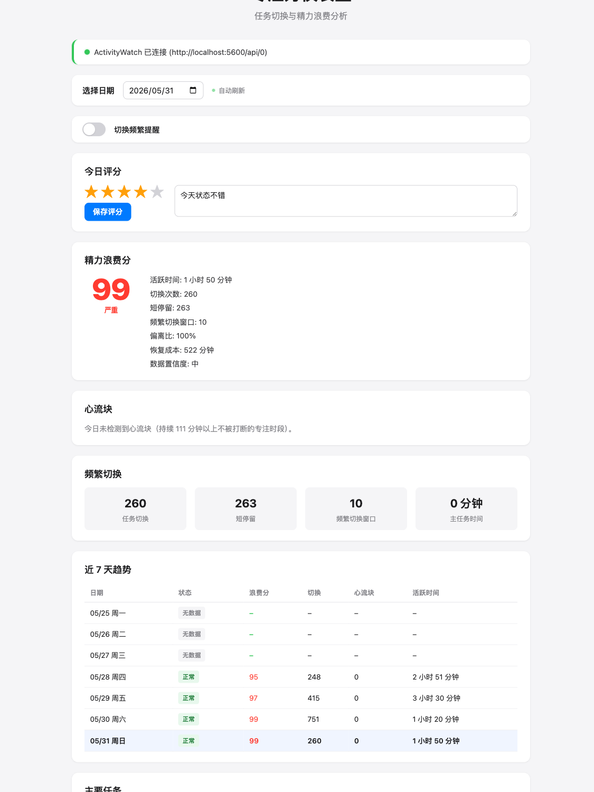
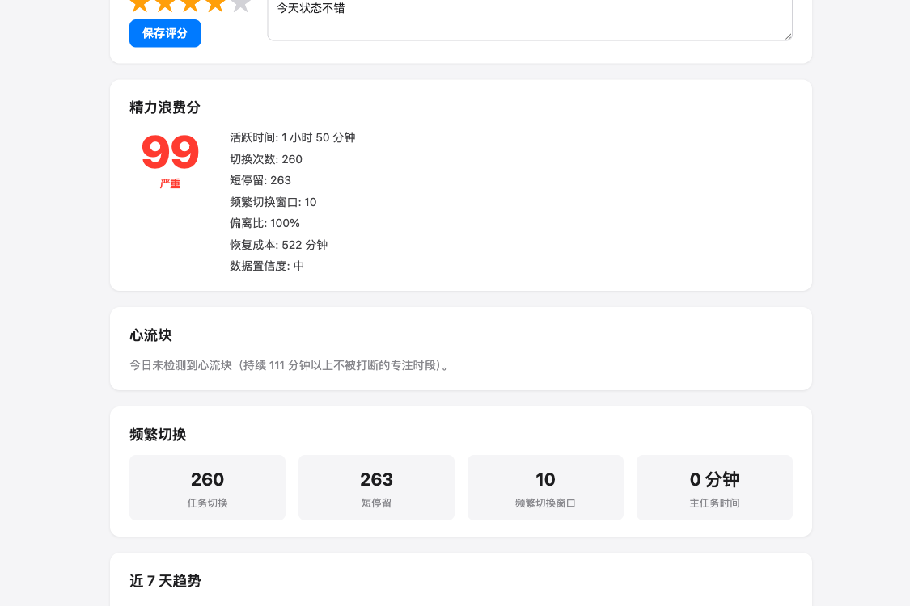
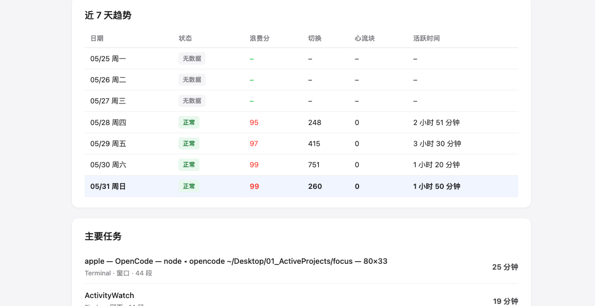
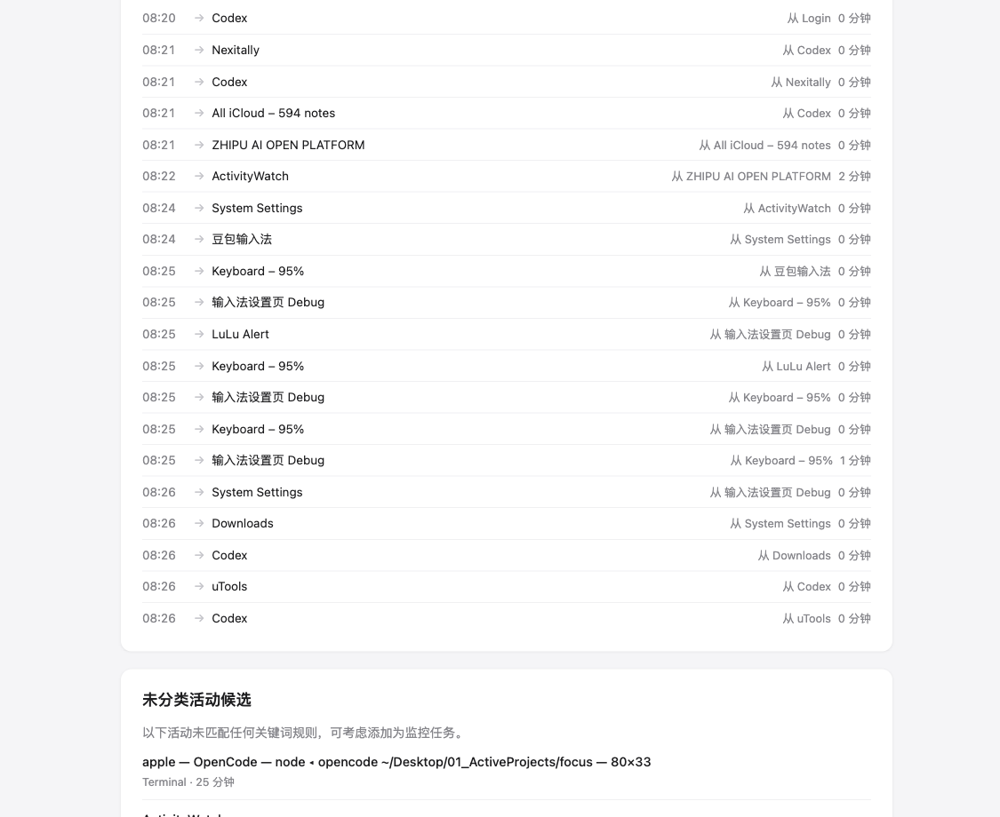
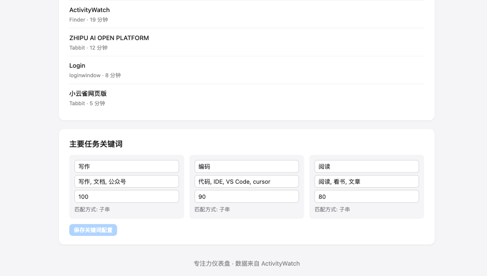
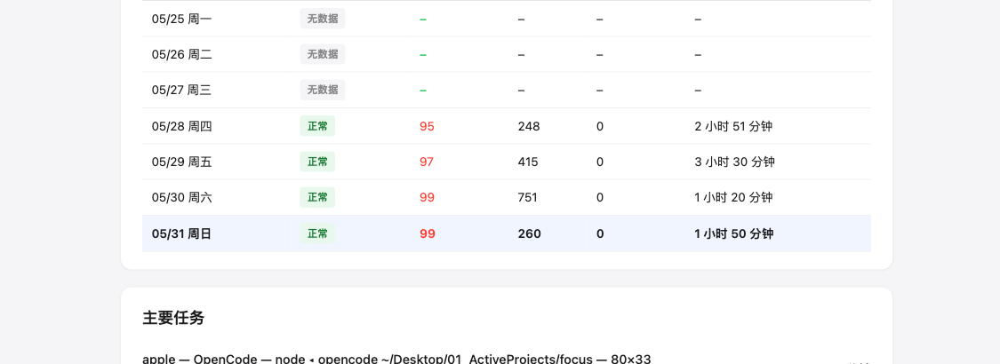

# AttentionBudget — 看见你的注意力，才能管理它

<p align="center">
  
</p>

**像会计记账一样追踪每一分钟注意力，用量化数据 + 柔性引导，让你主动选择专注。**

[](https://opensource.org/licenses/MIT)

---

## 🎯 为什么市面上没有类似产品？

市面上所有「专注工具」都在做同一件事：**替你决定什么时候该专注，然后屏蔽你**。

| 工具 | 做了什么 | 问题 |
|------|---------|------|
| RescueTime | 后台统计时间去向 | 只看不干预，事后诸葛亮 |
| StayFocusd | 强制屏蔽网站 | 粗暴，"我要用的时候就看不了" |
| Forest | 种树计时 | 移动端为主，浏览器里形同虚设 |
| 番茄钟类 | 25 分钟倒计时 | 一刀切，不管你是否真的在专注 |

**AttentionBudget 做了一件没人做的事：量化你的注意力消耗，然后让你自己决定。**

它不屏蔽任何网站。它告诉你——"你刚才连续切了 8 次窗口，今天的分心分已经到了 73。"你看完这个数字，自己就减少了无意义切换。

<p align="center">
  
</p>

> 💡 **「知道自己被量化了」本身就是最强的行为干预。** 这跟记账让你少花钱是一个道理——不是 App 阻止了你，是你看到数字后自己选择了不花。

---

## 🧠 为什么有效？

### 1. 切换成本比你想象的大得多

研究反复验证：**每次任务切换后，需要约 23 分钟才能完全恢复专注状态。**

你在 Codex 里写代码 → 看了一眼微信 → 切回来。你以为只花了 30 秒。但你的大脑花了 23 分钟才重新进入流畅状态。一天切 20 次 = 460 分钟就此消失。

AttentionBudget 把这个成本**实时算出来**给你看。

### 2. 量化反馈 = 行为改变

「我感觉今天很专注」和「今天我专注了 187 分钟，分心了 63 分钟」是两种完全不同的认知。后者是不可辩驳的。

注意力 → 可量化的数字 → 客观反馈 → 行为调整。不需要意志力，只需要看见。

### 3. 柔性引导 > 强制屏蔽

强制屏蔽会引发**心理逆反**——越不让你看，你越想看。而且你可能真的需要临时查点东西。

柔性引导：弹窗告诉你切换成本 + 今日剩余注意力，按钮是「继续当前任务」和「仍然切换」。你永远保留选择权。但知道代价后，大多数时候你选择了留下。

### 4. 心流检测不是猜的，是算出来的

市面上没有一款工具能告诉你**「今天你有几段真正的心流时间」**。

AttentionBudget 的心流检测算法：

- 连续在同一「主要事情」上停留 ≥ 25 分钟 → 一段心流
- 中间被打断 ≤ 2 分钟且之后立刻回到同一件事 → 容忍（是同事问问题，不是你真的分心了）
- 中间离开 > 3 分钟 → 截断，心流结束

这是一套从 ActivityWatch **桌面级真实行为数据**推导出的算法，不是番茄钟式的计时器。

<p align="center">
  
</p>

### 5. 你不止想知道「分心了」，还想知道「从什么事分心」

AttentionBudget 的切换时间线记录**最近 20 次**从一件事换到另一件事，精确到「从编码换到了微信」「从文档换到了 Twitter」。你知道的不只是数字，还有**分心的方向**。

<p align="center">
  
</p>

---

## ✨ 核心功能

### 🤖 分心程度分

一个 **0-100 分**的综合指标，用加权算法合成四个维度：

```
energyWasteScore = 
  0.35 × 频繁切换分 +
  0.25 × 短停留分 +
  0.25 × 偏离主线分 +
  0.15 × 恢复成本分
```

- **频繁切换分**：15 分钟窗口内切换 ≥ 6 次，每多一个窗口 + 25 分
- **短停留分**：在某件事上停留 ≤ 2 分钟的时间占比
- **偏离主线分**：不属于「我的主要事情」的时间占比
- **恢复成本分**：估算的注意力恢复成本（切换次数 × 1.5 分钟）

> 分数越高 = 越分心。低分是好事。

### 📊 心流时间段追踪

自动识别今天的每段「心流时间」——连续在同一件事上超过 25 分钟。会标注容忍的小插曲和 AFK 空隙。

### 📋 我的主要事情

你可以用**关键词规则**告诉系统你的「主要事情」是什么。比如：

```
编码: VS Code, Codex, GitHub, opencode
写作: 文档, 公众号, Notion
阅读: 文章, 论文, Kindle
```

系统会把命中的多个工具/网页自动合并为同一件事。比如 Codex 切到 VS Code？算法判断：同一件事，没分心。

<p align="center">
  
</p>

### 📈 7 天趋势

每天的分心分、专注时长、心流段数、切换次数，全部记录。一张表格看一周的注意力和情绪变化。

<p align="center">
  
</p>

### ⭐ 日评分

每天给自己打一个 1-5 分的主观评分，可附带备注。把客观数据和主观感受放在一起看，发现规律。

### 🌓 自动深色/浅色模式

跟随系统 `prefers-color-scheme`，不需要手动切换。

### 🔔 浏览器通知

检测到频繁切换时，浏览器弹出桌面通知提醒。可配置冷却时间。

---

## 🛠 安装

### 前置条件：安装 ActivityWatch

AttentionBudget 依赖 [ActivityWatch](https://github.com/ActivityWatch/activitywatch) 采集桌面窗口和应用使用数据。

**为什么需要 ActivityWatch**：浏览器插件只能看到浏览器里的标签页。你用 VS Code 写代码、用 iTerm 跑命令、用 Figma 画图——这些才是大头。ActivityWatch 记录所有窗口，AttentionBudget 负责分析。

```bash
# macOS
brew install activitywatch

# 其他平台
# 从 https://activitywatch.net/ 下载
```

安装后启动 ActivityWatch，确保它正在录制数据。访问 `http://localhost:5600` 验证。

### 安装 Focus Dashboard

```bash
# 克隆
git clone https://github.com/ouxxyy/Attention.git
cd Attention/focus

# 安装依赖
npm install

# 启动（同时启动后端 + 前端）
npm run dev
```

浏览器打开 `http://localhost:5173`，即可看到仪表盘。

> Node >= 18  |  后端端口: 8787  |  前端端口: 5173

---

## 📁 项目结构

```
Attention/
├── focus/                      # Focus Dashboard（全栈仪表盘）
│   ├── server/                 # Express 后端
│   │   ├── index.ts            # 入口，端口 8787
│   │   ├── routes.ts           # API 路由
│   │   ├── activitywatch.ts    # ActivityWatch API 客户端
│   │   ├── storage.ts          # 数据读写 + 校验
│   │   └── summary.ts          # 日汇总 + 趋势构建
│   ├── shared/                 # 前后端共享
│   │   ├── metrics.ts          # ⭐ 核心指标计算（分心分 + 心流 + 切换）
│   │   ├── normalize.ts        # 事件归一化（心跳展开、web叠加、去重、合并）
│   │   ├── schema.ts           # JSON 校验
│   │   ├── types.ts            # 类型定义
│   │   └── defaults.ts         # 默认配置 + 空评分
│   ├── client/                 # Vite + React 18 前端
│   │   └── src/
│   │       ├── App.tsx         # 单页仪表盘
│   │       └── api.ts          # 前端 API 封装
│   ├── data/                   # 持久化目录
│   │   ├── config.json         # 运行时配置
│   │   └── ratings.json        # 每日主观评分
│   └── docs/                   # 截图
└── extension/                  # Chrome 扩展（开发中）
```

---

## 🧮 API 端点

| 方法 | 路径 | 说明 |
|------|------|------|
| GET | `/api/health` | ActivityWatch 连接状态 + bucket 列表 |
| GET | `/api/buckets` | 发现并分类 bucket 列表 |
| GET | `/api/events?date=YYYY-MM-DD` | 当天原始事件 |
| GET | `/api/summary?date=YYYY-MM-DD` | 当天汇总（指标 + 心流 + 时间线） |
| GET | `/api/trends?days=N&end=YYYY-MM-DD` | 多日趋势（默认 7 天） |
| GET | `/api/config` | 读取配置 |
| PUT | `/api/config` | 更新配置 |
| GET | `/api/ratings` | 读取全部评分 |
| PUT | `/api/ratings/:date` | 写入某日评分（1-5 分 + 备注） |

---

## 🧪 技术栈

| 层级 | 技术 |
|------|------|
| 前端框架 | React 18 + TypeScript |
| 后端框架 | Express + TypeScript |
| 构建工具 | Vite |
| 测试框架 | Vitest |
| 数据采集源 | ActivityWatch（本地） |
| 数据存储 | 本地文件系统（`data/` 目录） |
| 通知 | Web Notification API |

---

## 🔒 隐私说明

- ✅ 所有数据**完全存储在本地**，不上传任何服务器
- ✅ 不需要注册账号，不需要登录
- ✅ 依赖 ActivityWatch 的本地数据采集，数据归你所有
- ✅ 评分、配置等个人数据存储在 `data/` 目录，可在 `.gitignore` 中排除
- ✅ 支持一键清除所有数据

**此项目不会，也永远不会收集你的浏览数据到云端。**

---

## 📮 联系我们 & 反馈

关注公众号「你关注的」，获取更多注意力管理方法和产品更新。有任何功能建议、Bug 反馈，或想分享你的专注心得，欢迎通过公众号联系我们。
>
> 也欢迎提交 Issue 和 PR！

---

## 📄 License

MIT License

---

## 🌟 路线图

- [ ] Chrome 扩展版本（轻量版，浏览器内直接使用）
- [ ] 智能分心网站识别（自动识别时间黑洞）
- [ ] 周报 / 月报导出
- [ ] 跨日专注对比分析
- [ ] 集成 Google Calendar，关联日程与注意力数据

---

**AttentionBudget** —— 不是让你戒掉分心，是让你看见自己的注意力去哪了。剩下的，你自己决定。

