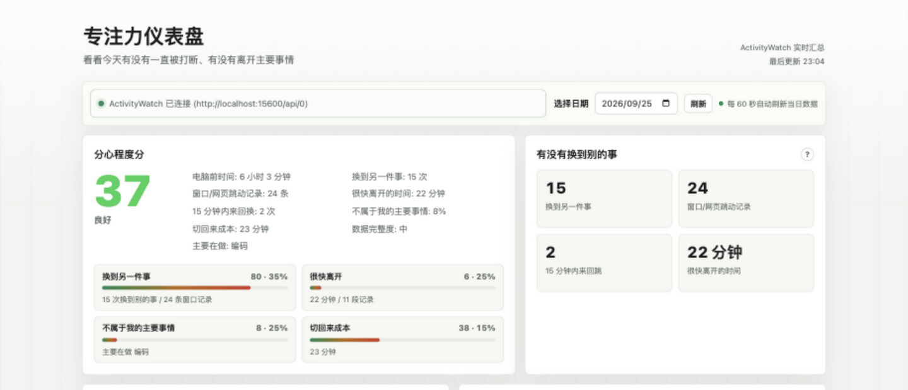
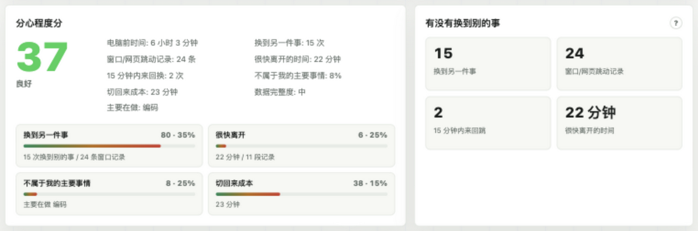
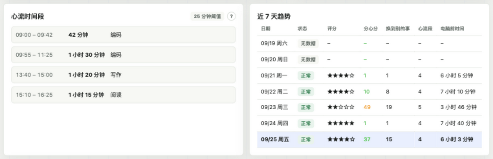
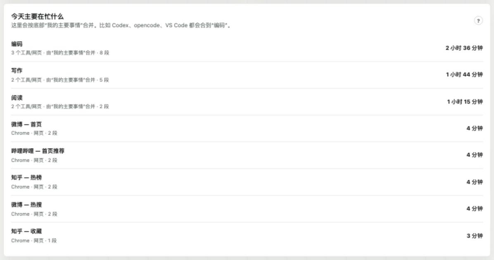
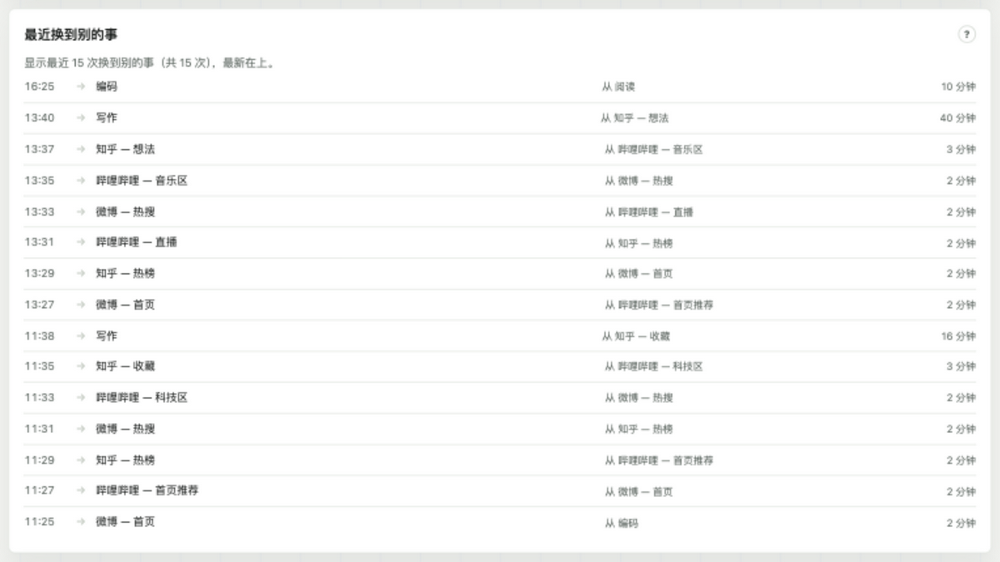
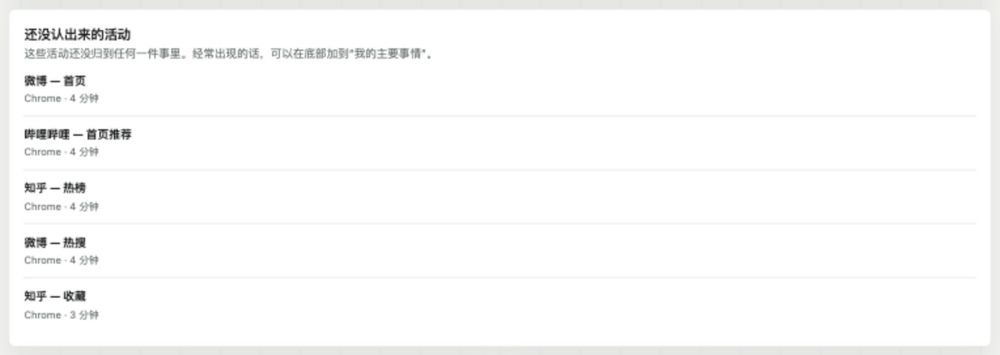
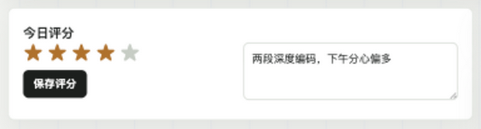
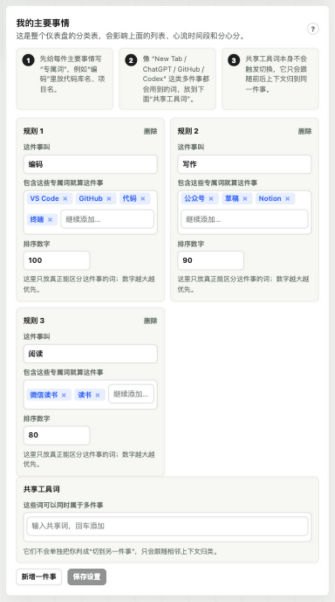
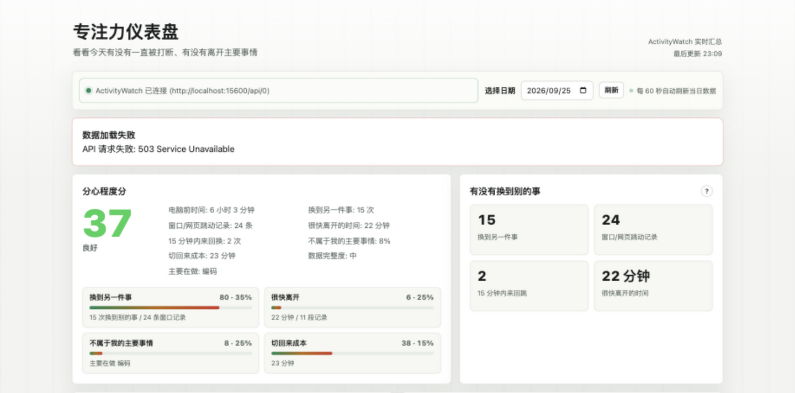

# Attention · 本地专注力仪表盘

盯着电脑工作了一天，却说不清时间都花在哪、被打断了几次？Attention 读取 [ActivityWatch](https://activitywatch.net/) 的桌面行为数据，每天给你一份说得清的答案：换到别的事几次、哪些时段真正连续专注、有多少时间花在主要事情之外。数据全部留在本机，不上传任何服务器。



左边是当天的分心程度分和四个扣分来源，右边是切换次数的原始计数；下面直接列出检测到的心流时间段和近 7 天趋势。

## 它会怎么做

1. ActivityWatch 在后台记录窗口标题、浏览器标签页和离开电脑的时间。
2. 仪表盘把这些原始事件整理成一段段时间线，去掉抖动和重叠。
3. 你在「我的主要事情」里定义几件事（比如编码、写作、阅读）和各自的关键词，同类工具自动归到同一件事。
4. 页面给出当天报告：分心程度分、心流时间段、主要任务分布、最近切换记录，以及可打分的今日评分。
5. 数据和配置都存在本地 `data/` 目录，纯本机运行。

## 效果一览

**分心从哪来** —— 四个子分分别对应「换到别的事」「很快离开」「不属于主要事情」「切回来成本」，每个都能展开看到原始计数。



**心流时间段** —— 同一件事连续累计 25 分钟以上就会标记出来，中间 2 分钟以内的小插曲可以容忍；近 7 天趋势直接对比每天的专注状况。



**时间花在哪** —— 按你定义的「主要事情」合并同类工具后排序，浏览器的走神记录也会单独列出来。



**切换记录** —— 每次从一件事跳到另一件事都有时间戳和来源，分心爆发一眼可见。



**没认出来的活动** —— 命中不了任何规则的活动会集中在这里，提醒你补一条规则。



**每日主观评分** —— 给当天打分并留一句话备注，趋势表里直接以星星展示，和客观数据放在一起回看。



## 快速开始

前置条件：

- Node >= 18
- [ActivityWatch](https://activitywatch.net/) 已在本机运行（默认 `http://localhost:5600`），且至少有 `currentwindow` 和 `afkstatus` 两类 watcher；装了浏览器扩展（`web.tab.current`）后网页数据会更完整

```bash
npm install
npm run dev
```

打开 `http://localhost:5173` 即可。`npm run dev` 会同时启动后端（端口 8787）和前端开发服务器。

第一次使用先到页面底部「我的主要事情」里配置几件事和关键词——分类是所有指标的基础，这一步做完报告才有意义。



## 数据与隐私

- 全部数据留在本机：行为数据在 ActivityWatch 里，配置和评分在本仓库的 `data/` 目录（已加入 `.gitignore`，不会提交）。
- 没有账号、没有云端、没有遥测。
- 界面跟随系统浅色/深色模式。

## 故障排除

ActivityWatch 没启动时，页面顶部会出现明确的错误提示，修复后点「刷新」即可：



| 现象 | 检查项 |
|------|--------|
| 顶部提示数据加载失败 | 确认 ActivityWatch 已启动，访问 http://localhost:5600/api/0/info 应返回 JSON |
| 当天数据为空 | 确认 ActivityWatch 的 window/afk watcher 正在录制 |
| 数据完整度低 | 浏览器扩展没装或没生效，只有窗口标题可用 |
| 分心程度分为 0 | 当天活跃时间不足或没有切换行为，属正常 |
| 端口被占用 | 后端默认 8787，前端默认 5173 |

## 指标口径（参考）

<details>
<summary>分心程度分（0-100，越低越好）</summary>

```
energyWasteScore = round(
  0.35 × frequentSwitchScore +
  0.25 × shortStayScore +
  0.25 × deviationScore +
  0.15 × recoveryScore
)
```

| 子分 | 口径 |
|------|------|
| frequentSwitchScore | min(100, 频繁切换窗口数 × 25 + 换到另一件事次数 × 2) |
| shortStayScore | 很快离开的时间占比（片段 ≤ 2 分钟记为短停留） |
| deviationScore | 不属于任何「主要事情」的时间占比 |
| recoveryScore | min(100, 换到另一件事次数 × 1.5 分钟 ÷ 60) |

「换到另一件事」先按主要事情聚合：Codex、opencode、VS Code 都命中「编码」时，它们之间来回切仍算同一件事；任一侧不足 15 秒的小抖动不计入。

</details>

<details>
<summary>心流时间段判定</summary>

同一件「主要事情」下，活跃时长 ≥ 25 分钟（`flowMinMinutes`）的连续时段；容忍的打断次数 ≤ floor(活跃时长 ÷ 25)；单次打断 ≤ 2 分钟且之后回到同一件事；离开电脑超过 3 分钟（`afkGraceMinutes`）重新计算。

</details>

<details>
<summary>默认阈值与数据假设</summary>

```json
{
  "flowMinMinutes": 25,
  "shortSwitchMaxMinutes": 2,
  "frequentSwitchWindowMinutes": 15,
  "frequentSwitchCount": 6,
  "afkGraceMinutes": 3
}
```

可在 `data/config.json` 或页面里修改。心跳事件（duration=0）向后推断至下一个事件、最长 120 秒；网页事件与窗口事件重叠 ≥ 50% 时以网页为准；相邻同任务片段间隔 ≤ 60 秒自动合并。完整算法见 [docs/AGGREGATION_ALGORITHM.md](docs/AGGREGATION_ALGORITHM.md)。

</details>

## API（开发者）

| 方法 | 路径 | 说明 |
|------|------|------|
| GET | `/api/health` | ActivityWatch 连接状态 + bucket 列表 |
| GET | `/api/summary?date=YYYY-MM-DD` | 当天汇总（指标 + 心流段 + 时间线） |
| GET | `/api/trends?days=N&end=YYYY-MM-DD` | 多日趋势（默认 7 天） |
| GET | `/api/events?date=YYYY-MM-DD` | 当天原始事件 |
| GET / PUT | `/api/config` | 读取 / 更新配置（写入经 schema 校验） |
| GET | `/api/ratings` | 全部每日评分 |
| PUT | `/api/ratings/:date` | 写入某日评分（1-5 分 + 备注） |

配置与评分存放在 `data/`：`config.json`（阈值、关键词规则、通知）、`ratings.json`（每日评分）。两者都有 schema 校验，非法写入返回 400 和具体原因。参考 `data/config.example.json` 与 `data/ratings.example.json`。

## 测试

```bash
npm run test:run
```

覆盖事件归一化、指标计算和 schema 校验，位于 `shared/__tests__/`。

## 作者

作者全平台同名：**欧八同学**。

- 微信公众号：扫码关注
- 抖音：[搜索“欧八同学”](https://www.douyin.com/search/%E6%AC%A7%E5%85%AB%E5%90%8C%E5%AD%A6)
- 小红书：[搜索“欧八同学”](https://www.xiaohongshu.com/search_result?keyword=%E6%AC%A7%E5%85%AB%E5%90%8C%E5%AD%A6)
- X：[搜索“欧八同学”](https://x.com/search?q=%E6%AC%A7%E5%85%AB%E5%90%8C%E5%AD%A6&src=typed_query)

<p align="center">
  
</p>

如果这个项目对你有用，欢迎点个 Star。遇到问题时，提交使用的命令、报错信息和最小复现步骤就够了。

## 许可证

[MIT](LICENSE)
